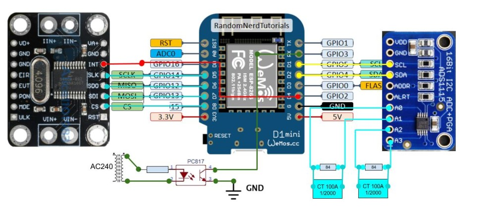
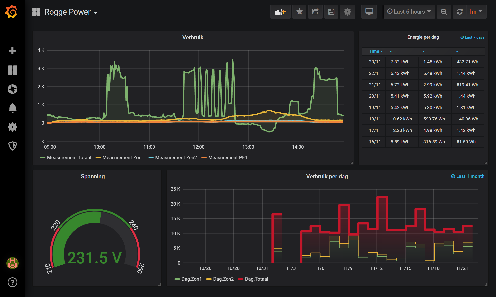

PowerMeter
==========
(Arduino/PlatformIO/Visual Code).

ESP8266 based powermeter with following characteristics:

1. Primary powermeter using CS5460 module  (in my case used to measure total power consumption home).
	- The module is set in continuous mode. +/- one cycle per second. Interrupt signals when measurement is ready.
2. 2 secundary current measurements (using current transformers) on ADS1115 module (in my case used to measure output 2 solar arrays).
    - ADS1115 in Continuous Differential mode (tolerates small negative values). (using modified Adafruit_ADS1X15 library)
    - We take samples each +/- 20625 µs (once per cycle, shifting through cycle over 32 samples) (on 50hz!!)
    - We calculate current zerocross after 32 cycles and calculate powerfactor using voltage zerocross detection in 3.
    - Switch between the two CT's each second.
    - Measuring 30 cycles for each CT every minute.
3. 1 circuit to detect the zerocross/frequency of the voltage to calculate real power of secundary current measurements.
    - Simple circuit using voltage of transformer, resistor and opto coupler.
4. Integrated webserver to present som json files (to be used in other projects).
5. Output is send to Nodered (and from nodered to InfluxDB and Grafana).

PowerMeter output will be used in my ESP32 based 'SmartCarCharge' project (A Smart Level 2 Car Charger)

Project is still in development. Error after calibration is less then 1% (Reasoned guess since I don't have calibrated measuring equipment available).  Any suggestion on optimalisation are welcome!

Hardware: ESPPowermeter.jpg

Example dashboard Grafana: Grafana.png

